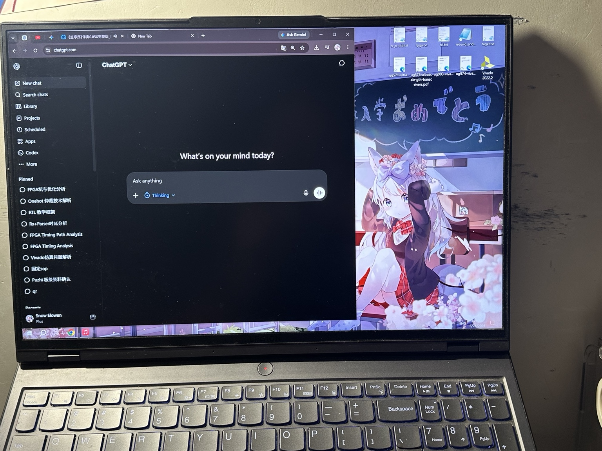
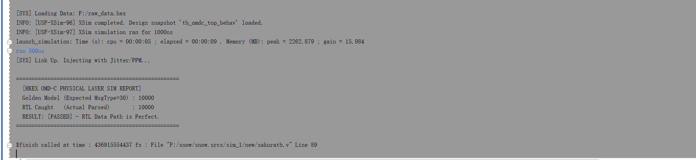
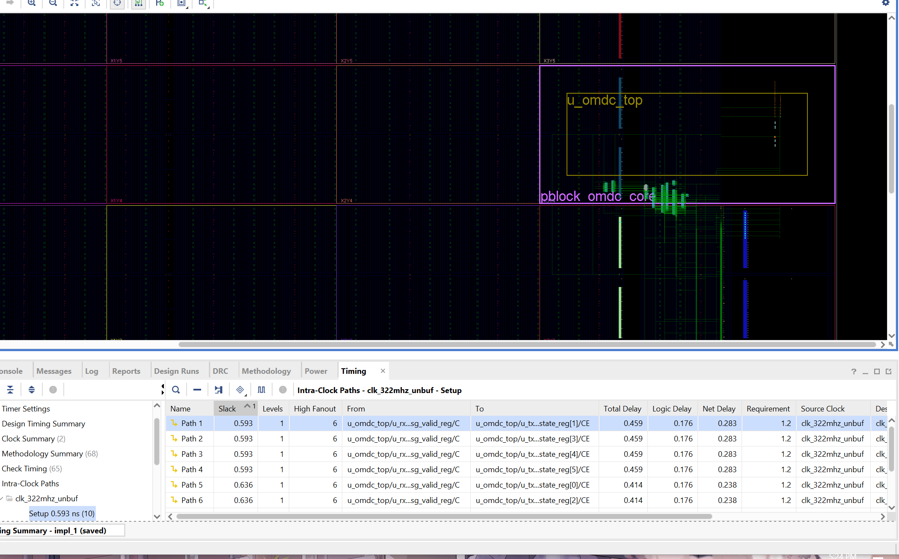
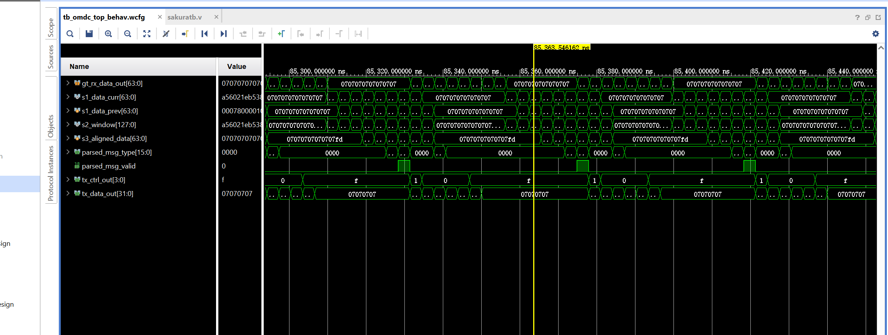

# SnowSakura-FPGA

## Deterministic Physical-Layer FPGA Architecture for HKEX OMD-C on ZU15EG / VU9P

**Current architecture target:** fixed-cycle fabric pipeline for HKEX OMD-C market-data normalization, parsing, arbitration, and TX release, with the PMA latency budget treated explicitly instead of hidden inside RTL timing claims.

**Target devices:** Xilinx Zynq UltraScale+ **XCZU15EG FFVB1156** and Virtex UltraScale+ **VU9P**  
**Primary clock target:** **322.56 MHz** fabric over-constraint / **322.265625 MHz** standard 10.3125G-related reference point  
**Transceiver path:** **GTH Raw Mode / RX-TX Buffer Bypass**  
**Current latency model:** Fabric fixed-cycle path + explicitly budgeted **~18 ns PMA latency**  
**Current verification focus:** post-route STA, SDF timing simulation, stricter testbench modeling, then real ZU15EG + SFP loopback, Eye Scan, and BER measurement.

---

## Current Final Architecture Snapshot — 2026-06-24

The final single-channel architecture is now defined as a fixed-cycle pipeline:

| Stage | Budget | Physical meaning |
|---|---:|---|
| RX normalization | 3 cycles | Raw/PCS-lite boundary normalization, alignment-owned valid/data handoff, fixed parser interface |
| Parser extraction | 1 cycle | Fixed-offset OMD-C field extraction; no runtime barrel shifter in steady-state |
| Arbitration | 2 cycles | Dual-path-ready arbitration budget; sequence/gap/recovery logic separated from RX physical alignment |
| TX release | 1 cycle | Pre-registered TX template/control release path |
| PMA latency | ~18 ns | GTH Raw Mode / Buffer Bypass physical transceiver budget |

This replaces the earlier mixed wording around 31.5 ns / 36 ns / 37 ns. The historical logs are preserved below because they show the learning curve and timing evidence progression, but the **active architecture statement** is the 2026-06-24 model.

The current verification direction is also stricter than the earlier README language. I no longer treat slogans such as “zero jitter” as proof. The next validation layer is concrete: **BER measurement, Eye Scan, SFP loopback, post-route timing, and hardware evidence**.

---

## What SnowSakura Is

SnowSakura-FPGA is a physical-layer FPGA research and implementation project for ultra-low-latency HKEX OMD-C ingestion. The project focuses on the boundary where protocol parsing, timing closure, transceiver behavior, and physical routing interact.

This is not a CPU parser, not a kernel-bypass software stack, not a PCIe capture-card project, and not a vendor-MAC/AXI FIFO demonstration. The design philosophy is to map the fast path directly into FPGA primitives and physical routing resources:

- **FDRE** boundaries for deterministic cycle ownership
- **LUT6 / LUT5** logic-depth accounting
- **CARRY8** only where its dedicated carry chain is physically justified
- **GTH** Raw Mode / Buffer Bypass path exploration
- **Pblock**, placement, routing locality, and clock-region awareness
- post-route **STA**, **SDF timing simulation**, and later board-level BER/Eye evidence

In this project, Verilog is not treated as abstract software. Every fast-path line must eventually correspond to physical resources: flip-flops, LUT inputs, carry-chain segments, local interconnect, switch matrices, clock trees, and routed nets.

---

## Critical Fast-Path Rules

The current SnowSakura fast-path discipline is strict:

1. **No runtime barrel shifter in the steady-state RX path.**  
   A dynamic `offset +: width` slice maps to a mux/barrel network, not a wire. It is useful in bring-up experiments, but not acceptable in the final fixed-cycle steady-state path.

2. **No 64-way scanner in the final RX path.**  
   A wide preamble/SFD scanner can be useful for bring-up, but after alignment is locked, the parser must consume a fixed interface.

3. **No Async FIFO in the latency-critical path.**  
   CDC safety matters, but an elastic FIFO destroys the fixed-cycle fabric budget. The final fast path must be same-domain or phase-related with verified clock interaction.

4. **No unbounded control fanout.**  
   Parser valid, arbitration select, packet valid, and TX release controls must be replicated or localized when fanout threatens routing delay.

5. **No hidden vendor pipeline.**  
   Vendor MAC, AXI, or elastic PCS buffering is not part of the flagship latency model unless explicitly counted.

6. **No timing claim without post-route evidence.**  
   Functional simulation alone is not timing closure. The evidence chain must include reports such as WNS/WHS, logic levels, high-fanout nets, clock interaction, route delay, and eventually hardware BER/Eye results.

---

## Built From Almost Nothing — 2026 2.10

Some people may assume that this project came from a well-equipped lab, a research group, or an institutional environment.

It did not.

This project was not built in a university lab. There is no professor behind it, no research group, no company team, no hidden institutional support, and no ready-made hardware lab.

This was the starting environment:

- one laptop
- one desk lamp
- one pen
- public documentation
- repeated engineering iteration
- and one GPT



Every RTL file, every testbench, every timing report, every post-simulation result, every architecture revision, and every physical-layer correction came from independent learning: reading documentation, writing code, breaking assumptions, debugging simulations, studying timing paths, and learning how FPGA hardware actually behaves through FDREs, LUTs, routing wires, GTH configuration, CDC boundaries, and post-implementation evidence.

This repository is the record of that process.

---

## The Logic Arena

I am open to serious technical discussion, adversarial review, and collaboration around FPGA market-data infrastructure, deterministic latency, transceiver bring-up, and nanosecond-scale timing closure.

**Email:** `ruansheng333@gmail.com`  
**Status:** open for deep-dive technical discussion and advisory work.

---

# Engineering Log

The following log intentionally preserves the original time stamps and image pointers. Earlier sections may contain historical targets or terminology that were later corrected. The most current architecture is the 2026-06-24 update above.

---

## 2026-03-18 — Initial ZU15EG Physical Timing Log

### Stage 1: Datapath Routing & Net Delay Suppression


At 322 MHz-class timing, routing delay is not background noise. The first major timing lesson was that **Net Delay** can dominate the path even when **Logic Delay** is already small.

Observed timing direction from this phase:

- Logic delay was pushed under approximately 1 ns in representative paths.
- Net delay around the 1.5 ns range became the practical enemy.
- Placement locality and routing shape mattered as much as RTL structure.

The lesson from this phase was simple: a fast-looking RTL path can still fail if the placement creates a long physical route through switch matrices and interconnect tiles.

### Stage 2: Floorplanning & Initial Timing Closure


This phase introduced stricter physical isolation and Pblock-driven locality.

Reported metrics from the original implementation log:

- **WNS:** +0.708 ns
- **WHS:** +0.024 ns
- **Failing endpoints:** 0

The important engineering point is not the number alone; it is what the number forced me to learn. Setup and hold must both survive after implementation. A path that is only “logically simple” is not accepted until the routed timing report proves it.

### Stage 3: Full Pipeline Squeeze @ 322 MHz


As the parser grew, the timing window became more constrained. This phase established the habit of reading the implementation result as a physical object rather than treating synthesis as the final answer.

Reported metrics from this stage:

- **WNS:** +0.472 ns
- **WHS:** +0.030 ns
- **Failing endpoints:** 0 across 542 endpoints

This stage also made clear that clock tree behavior, register placement, routing detours, and fanout cannot be discussed separately from RTL.

---

## 2026-04-29 — Phase 3 RX-Parser-TX Single-Channel Validation

### I. Latency Validation: Waveform Snapshot


This phase explored the direct RX-to-parser timing model under GTH Raw Mode assumptions. The waveform evidence was used to study deterministic cycle behavior from Start-of-Packet detection into parser output signaling.

### II. Implementation Details: Synthesis Schematic


The purpose of this schematic phase was to inspect whether RTL intent actually mapped to the expected primitive-level structure.

Key physical concerns in this phase:

- FDRE ownership of data and valid signals
- LUT depth on parser control paths
- whether direct mappings remained local or became routed detours
- whether debug/demo outputs distorted the fast-path structure

The early README used more aggressive language such as “direct physical mapping” and “zero-latency clock enables.” The corrected interpretation is stricter: a schematic can show topology, but only post-route timing and hardware measurement can prove timing and latency behavior.

### III. Static Timing Report Summary

Reported metrics preserved from this stage:

- **Timing constraints:** met
- **Failing endpoints:** 0 across 542 endpoints
- **WNS:** +0.472 ns
- **WHS:** +0.030 ns

The useful conclusion from this stage was that the physical path could be constrained into a timing-clean shape under the tested fabric model. It was not yet final board-level proof.

### Proprietary Constraint Policy

Detailed XDC/TCL constraints, exact coordinate mappings, LOC/BEL assignments, and physical placement strategy are not published in this repository. The public repository shows architecture, testbench direction, timing evidence, and development logs; the proprietary physical implementation scripts remain private.

---

## VU9P Matrix Scaling & SLR Isolation

### Stage NEW: VU9P Matrix Scaling & SLR Isolation

Scaling the core engine to VU9P introduced a different physical enemy: die size and SLR boundary pressure.

Original reported metrics:

- **WNS:** +2.011 ns
- **WHS:** +0.159 ns
- **Net Delay:** 0.760 ns
- **Logic Delay:** 0.217 ns

The key lesson was that interconnect dominated logic delay even more clearly in the larger device context. SLR placement is not a cosmetic floorplanning choice; crossing large physical regions can add nanosecond-scale penalty.

### Stage 2: High-Fanout Congestion Management & Routing Matrix Pressure


High-fanout controls such as `packet_valid`, `sof_detect`, parser enable, and arbitration select lines can become physical routing problems before they become logical problems.

Practical rule established in this phase:

- fanout above roughly 12 on critical controls must be reviewed
- register replication is preferred over allowing a global control net to drive a wide mux field
- locality must be checked in the implemented design, not assumed from RTL hierarchy


This reinforced the rule that moderate fanout can become a timing problem when it forces the router to bridge distant CLEM/CLB regions.

---

## Physical-Layer Control Notes

### Manual Placement, Logic Levels, and Latency

The historical README used phrases such as “absolute control,” “Logic Level = 0,” and “surgery on silicon.” The corrected engineering interpretation is:

- A path with **0 reported logic levels** still has route delay, clock uncertainty, setup requirement, and hold requirement.
- A direct-looking route in Device View must still be verified by `report_timing`.
- Manual placement can reduce detours, but it can also create congestion if the Pblock is wrong or too tight.
- Timing closure is a physical report, not a visual impression.

### Art on Silicon / Routing Evidence


These images are preserved as historical physical-layout evidence. The current way to interpret them is not as a standalone proof, but as part of a larger evidence chain: placement view, timing report, route delay, fanout report, and timing simulation.

### New Simulation


Simulation helped expose functional behavior and pipeline timing. The later project direction corrected an important limitation: simulation must distinguish functional parser success from GTH/Raw Mode/CDC physical proof.

---

## Technical Specification & Performance Edge — Historical Summary

The early public specification emphasized several aggressive ideas:

- GTH PMA/PCS bypass exploration
- 128-to-64 sliding-window experiments
- parallel preamble/SFD sniffing
- CARRY8-assisted validation logic
- fixed-stage deterministic pipeline structure

The corrected current interpretation is stricter:

- A **sliding window** can be useful for testbench, bring-up, or reference experiments, but a runtime barrel shifter does not belong in the final steady-state RX fast path.
- A **parallel preamble scanner** is useful during alignment, but it must not remain as a high-fanout steady-state scanner that loads the critical path.
- **CARRY8** is useful only where its physical carry chain actually reduces delay and where post-route timing confirms it.
- A deterministic pipeline must be counted in cycles and ns, not described only with slogans.

### Hardcore Timing Metrics — Historical Post-Implementation Notes

Preserved metrics from the original log:

- **WNS:** +0.511 ns under a 1.2 ns cross-module deadline
- **WHS:** +0.009 ns
- **Reported Logic Level:** 0 on selected paths

Correct interpretation:

A 9 ps hold margin is not a marketing trophy; it is a warning that hold timing is flying close to the ground. It is valid only if the implemented timing report, clock uncertainty, min-delay analysis, and endpoint coverage are correct.

### Next Python Test


---

## 2026-05-15 — First Public Simulation Release

### Major Milestone: IEEE 802.3 Framework Refactor & OMD-C Throughput Breakthrough

**Current status at that time:** v0.7-Alpha Refactored


At this point the project moved from isolated timing experiments toward a more complete IEEE 802.3 / OMD-C simulation framework.

Historical result preserved from the original log:

- packet capture improved from roughly 10% to **71.3%**
- test data and testbench direction began moving toward public reproducibility
- the framework started exposing real parser-state and packet-validity issues

Special acknowledgement preserved:

Frank Bruno’s high-speed serial-interface insights were an important external influence during this phase.

### Next Steps From This Phase

The immediate target after this release was to map the remaining loss mechanism and correct the FSM / packet-validity handling without adding latency.

---

## Update: Cracking the 9,900+ Barrier & Public Stress Test Release

The next public stress-test milestone achieved:

- **9,974 / 10,202** packet captures
- approximately **97.8%** success rate under the then-current simulation assumptions
- public stress test using `tb_omdc_top.v` and `raw_data.hex`


### What Was Inside the Stress Test

The testbench attempted to model harsher physical-layer conditions than an ideal single-clock parser test:

- clock skew / ppm offset concept
- random jitter injection at ps-scale simulation resolution
- sub-ns phase perturbation experiments
- raw-data stream ingestion through the simulation framework

Correct current interpretation:

This was a useful stress simulation, not a replacement for GTH board-level proof. It proved that the parser framework was improving, but the final evidence still requires post-route timing, real transceiver configuration, SFP loopback, Eye Scan, and BER measurement.


### The Final 2.2%

At this time the remaining loss was treated as the final frontier of the simulated RX/parser system.


### Repository Structure — Simulation

```text
/sim/tb_omdc_top.v   : high-precision physical-layer testbench
/sim/raw_data.hex    : HKEX OMD-C raw binary stream test dataset
```

---

## Zero-Detour Manifesto — Routing Geometry Notes

The original Zero-Detour section focused on direct routing geometry and the desire to eliminate unnecessary detours.

Corrected technical meaning:

- Short Manhattan distance can reduce route delay.
- Fewer switchbox hops can reduce uncertainty and skew.
- But route shape must still be validated through implemented timing reports.
- A clean visual route is not automatically a valid 36–37 ns system proof.


This section is preserved because physical geometry is central to the project. The wording is tightened so that the claim is tied to verifiable implementation evidence rather than visual confidence alone.

---

## 2026-05-18 — 100% Zero-Loss Simulation Completion

This milestone marked completion of the first major pre-university simulation target.

Historical result preserved:

- **10,000 / 10,000** packet ingestion in the test stream
- no added pipeline cycle in that simulation architecture
- wire-to-wire budget still framed around the 36 ns-class target



### Simulation Report — Vivado XSim

The historical note said: “Only 1 logic level.”  
The corrected interpretation is: selected paths showed very low logic depth in the tested netlist, but final acceptance still requires routed timing, endpoint coverage, high-fanout review, and hardware measurement.

### How the Final Loss Was Removed — Physical-Layer Breakdown

1. **CDC / phase handling discipline**  
   The design moved away from relying on generic elastic buffering and toward deterministic phase/alignment ownership. Current rule: multi-bit payload CDC cannot be “fixed” by Triple-FF; only 1-bit status/control synchronization can use Triple-FF safely. Payload must be same-domain, phase-related, or explicitly normalized.

2. **Combinational logic gating discipline**  
   Critical paths were flattened and reviewed for logic-level count. Current rule: <=2 LUT layers in the GTH RX Data Path is the design limit, and it must be verified after implementation.

3. **TCL-locked floorplanning and timing closure**  
   Pblocks and physical constraints were used to keep the fast path local. Current rule: XDC/TCL constraints are part of the design, and missing endpoints should fail loudly rather than silently falling back.

Preserved reported metric from this phase:

- **WNS:** +0.593 ns on critical control paths in the tested implementation
- **Total Logic Delay:** approximately 0.176 ns on selected paths





---

## Phase 1 Complete — Pre-University Milestone

As of the May 18 milestone, the single-path parser had reached the first public simulation target under the available test environment.

The corrected current framing is:

- This was a major simulation and post-route learning milestone.
- It was not the end of validation.
- The next proof layer is real ZU15EG + SFP hardware validation.

---

## Next Frontier — Dual-Path Line A/B Arbitration & Recovery

HKEX OMD-C dual multicast lines introduce a different problem from physical RX alignment. Packet loss, duplicate packets, delayed packets, and gap recovery are network/protocol-layer concerns and must not be confused with Ethernet bit/block/byte alignment.

The next architecture layer must ingest both Line A and Line B, choose the first valid packet, mask duplicates, detect gaps, and prepare a recovery signal without blowing the latency budget.

### The 2-Cycle Arbitration Challenge

The dual-path arbitration budget is currently framed as **2 cycles** at 322.56 MHz, or about **6.2 ns**.

Within that physical budget, the design must avoid:

- full 32-bit sequence comparison inside the final mux cycle
- wide if/else priority structures
- unreplicated select signals driving 64-bit or 96-bit muxes
- global high-fanout control nets

The intended direction is a **chunked replicated one-hot arbiter**:

- precompute eligibility before the final arbitration cycle
- replicate local controls by payload chunk
- use one-hot AND-OR muxing instead of wide priority muxing
- keep `out_valid` / TX release control separate from payload chunk selection
- verify that replication survives synthesis and implementation

---

## 2026 6.24 — Final Architecture Update

The final single-channel architecture has now been defined as a fixed-cycle pipeline:

- **3 cycles** for RX normalization
- **1 cycle** for parser extraction
- **2 cycles** for arbitration
- **1 cycle** for TX release
- plus an explicitly budgeted **18 ns PMA latency** under the GTH Raw Mode / RX-TX Buffer Bypass path

This architecture has been validated through stricter FPGA-fabric-side post-route SDF timing simulation, while PMA latency is treated as part of the final wire-to-wire budget instead of being hidden inside a vague latency claim.

The old testbench was also replaced with a stricter verification setup. Looking back, the earlier testbench had major limitations, especially in how it modeled physical-layer behavior, packet validity, and RX ownership.

Compared with the beginning of 2026, the architecture has changed significantly:

- earlier wording overused “zero jitter”
- the current proof plan emphasizes BER, Eye Scan, and SFP loopback
- historical screenshots are now treated as development evidence, not final hardware proof
- the repository has become a record of the physical-layer learning curve, not only a timing-screenshot showcase

The ZU15EG board purchase plan has moved forward to July, with real SFP hardware validation expected after that.

---

## Evidence Checklist

Current and upcoming evidence layers:

- [x] RTL architecture iterations
- [x] functional simulation
- [x] stress-test dataset flow
- [x] post-route timing reports on tested fabric-side builds
- [x] SDF timing simulation flow
- [ ] ZU15EG board bring-up
- [ ] SFP loopback
- [ ] Eye Scan
- [ ] BER measurement
- [ ] long-duration error-free hardware run
- [ ] dual-path Line A/B arbitration validation

---

## Public / Private Boundary

Public repository:

- architecture notes
- selected timing screenshots
- stress-test direction
- development log

Private lab:
—Rawmode bypasss Rtl
- exact XDC/TCL placement strategy
- exact Pblock coordinates
- LOC/BEL mappings
- phase/alignment calibration scripts
- proprietary implementation constraints

Do not ask for the private XDC scripts. The public repository is intended to show the engineering direction and evidence chain; the physical implementation strategy remains private.

---

## Collaboration

If you want to challenge the architecture, discuss timing paths, review the physical assumptions, or collaborate around FPGA-based HFT infrastructure, contact:

**Email:** `ruansheng333@gmail.com`

SnowSakura is not a polished institutional project. It is an aggressive physical-layer engineering record built through direct iteration, timing evidence, and continued hardware validation.

