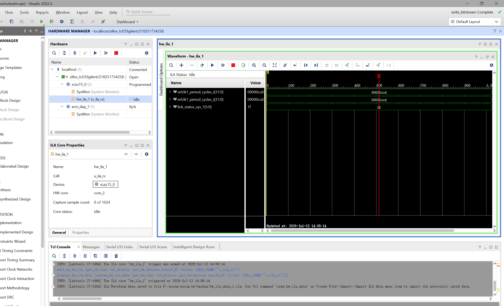
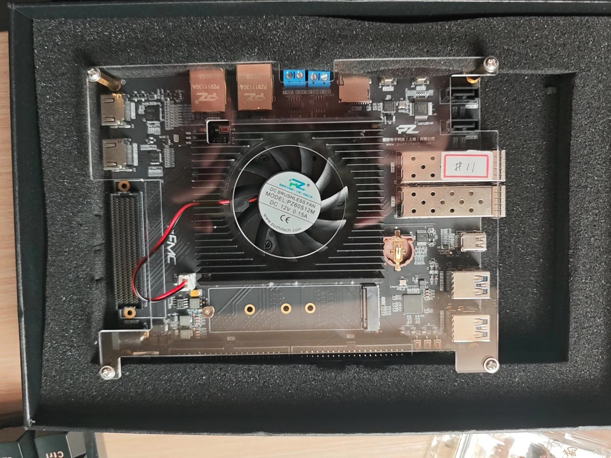

# SnowSakura-FPGA

## Deterministic Physical-Layer FPGA Architecture for HKEX OMD-C on ZU15EG / VU9P

SnowSakura-FPGA is a physical-layer FPGA project for HKEX OMD-C market-data ingestion, deterministic receive normalization, fixed-slice parsing, arbitration, and latency-controlled TX release on Xilinx UltraScale+ devices.

The repository records both the active ZU15EG hardware-delivery path and the lower-latency research path. Claims are separated by evidence level: functional simulation, post-route timing, SDF timing simulation, and real hardware measurements are not treated as interchangeable.

| Item | Current value |
|---|---|
| Primary device | Xilinx Zynq UltraScale+ `XCZU15EG-FFVB1156-2-I` |
| Secondary research device | Virtex UltraScale+ VU9P |
| Serial line rate | 10.3125 Gb/s |
| Fabric timing target | 322.56 MHz over-constraint / 322.265625 MHz standard operating point |
| Active transceiver path | GTH Raw Mode / RX Buffer ON / TX Buffer Bypass |
| Active hardware target | Measured sub-60 ns baseline |
| Research transceiver path | GTH Raw Mode / RX-TX Buffer Bypass |
| Research latency target | 40 ns-class, subject to hardware proof |

> **Current direction:** deliver the RX Buffer ON hardware baseline first. Preserve RX Buffer Bypass as the deterministic 40 ns-class research blade.

---

## Contents

- [Current Hardware Status](#current-hardware-status--2026-07-13)
- [Immediate Hardware Checklist](#immediate-hardware-checklist)
- [HKEX OMD-C Exchange Feed Simulator](#hkex-omd-c-exchange-feed-simulator)
- [Architecture Tracks](#architecture-tracks)
- [Fast-Path Engineering Rules](#fast-path-engineering-rules)
- [Verification Contract](#verification-contract)
- [Historical Engineering Log](#historical-engineering-log)
- [Public / Private Boundary](#public--private-boundary)
- [Collaboration](#collaboration)

---

## Current Hardware Status — 2026-07-13

SnowSakura has moved from a reset-blocked GTH state to the final receive-lock boundary on the real Puzhi ZU15EG + SFP/GTH setup. The current hardware evidence isolates the remaining blocker to RX CDR stability on the optical receive path; the OMD-C parser is not the failing block.

### Proven infrastructure

- Puzhi ZU15EG device, PL clock, LED, SFP disable, GTH lane, and MGT reference-clock mappings are incorporated into the active project.
- The reusable external top owns GT Wizard integration, reset sequencing, TX generation, RX capture, status reporting, and ILA visibility.
- Exact bitstream programming and matching ILA probe refresh have been demonstrated.
- A continuous MGT reference-clock source has been verified at the selected hardware boundary.
- The corrected integration routes cleanly and produces a hardware-programmable bitstream.
- Live ILA evidence shows PMA initialization and the tracked TX-side divider/bypass conditions have completed.

### `0x1F` ILA milestone



The pointer marks the live `link_status_sys = 16'h001F` capture. Within the low-six-bit initialization group, every tracked condition has asserted except RX CDR stability. This is a hardware initialization milestone, not RX payload data and not an OMD-C `MsgType`.

The previous GT initialization fault domain has therefore been reduced to the serial receive boundary. The next expected state is `16'h003F` after RX CDR stability asserts. Until then, parser RTL remains outside the active fault domain.

The remaining acceptance chain is deliberately narrow:

```text
SFP TX
    -> optical loopback
    -> SFP RX
    -> RX CDR stability
    -> changing raw RX words
    -> Level-0 pattern match
    -> fixed-frame progression
    -> OMD-C field extraction
```

No production RTL, board-routing recipe, transceiver primitive placement, XDC/TCL constraint, or calibration script is published by this update.

---

## Immediate Hardware Checklist

Acceptance is intentionally ordered. A later protocol check cannot compensate for an unproven earlier physical boundary.

### Program image and debug identity

- [x] Acquire the ZU15EG board and optical test setup
- [x] Incorporate the active Puzhi board mappings
- [x] Build the reusable GT hardware shell
- [x] Program an exact known bitstream
- [x] Refresh and match the corresponding ILA probe set

### GT initialization and clocks

- [ ] Prove the freerun/reset-helper clock is active
- [x] Prove a continuous MGT reference clock at the selected GT boundary
- [ ] Prove `gtpowergood`
- [ ] Prove QPLL0 lock and reference-clock selection
- [x] Prove TX/RX PMA reset completion
- [ ] Prove `tx_reset_done` and `rx_reset_done`
- [ ] Prove RX CDR stability
- [ ] Observe TXUSRCLK2 and RXUSRCLK2 counters
- [ ] Verify generated clock periods with `report_clocks`

### Physical data movement

- [ ] Show changing TX words in the intended TX user-clock domain
- [ ] Prove the selected SFP/lane/loopback route
- [ ] Show changing raw RX words on the intended lane
- [ ] Pass the Level-0 training-pattern checker
- [ ] Assert `pattern_match_sticky` with zero mismatch growth

### OMD-C hardware path

- [ ] Transmit the fixed 48-byte OMD-C payload from ROM
- [ ] Prove `payload_start`
- [ ] Prove `rx_payload_idx` progression
- [ ] Prove `rx_frame_done`
- [ ] Reconstruct Little-Endian `MsgType` as `16'h001E`
- [ ] Assert `msgtype_30_seen`

### Evidence and measurement

- [ ] Post-route STA for the active RX Buffer ON build
- [ ] Post-implementation SDF timing simulation
- [ ] Eye Scan capture and interpretation
- [ ] BER measurement
- [ ] Long-duration error-free hardware run
- [ ] Measured Version 2 wire-to-wire latency report
- [ ] Version 1 RX Buffer Bypass re-validation
- [ ] Dual-line A/B arbitration validation

---

## HKEX OMD-C Exchange Feed Simulator

The custom exchange feed simulator is a deterministic FPGA-side hardware test source. It is not a software packet replay and does not claim to recreate the complete HKEX exchange network.

Its purpose is narrower and physically testable: generate known OMD-C bytes, send them through the real GTH TX/SFP path, receive them through the selected GTH RX lane, and expose each boundary before parser output is accepted.

### Hardware chain

```text
omdc_packet_rom
    -> tx_feed_fsm
    -> GTH TX / SFP
    -> optical or board loopback
    -> GTH RX Buffer ON
    -> RX capture / pattern checker
    -> fixed-slice OMD-C parser
```

| Block | Physical role | Required evidence |
|---|---|---|
| `omdc_packet_rom` | Stores deterministic OMD-C test bytes | Byte-for-byte reference vector |
| `tx_feed_fsm` | Releases ROM words in the TX user-clock domain | Word index, start, completion |
| GTH TX / SFP | Sends the real 10.3125 Gb/s serial stream with TX Buffer Bypass | Reset status, TX clock, TX activity |
| Loopback path | Returns the stream to the selected RX lane | Proven port and lane mapping |
| GTH RX Buffer ON | Provides the active stable receive baseline | RX reset done, CDR state, RX clock |
| RX capture/checker | Registers RX words and checks movement before parsing | Raw activity, match flag, mismatch count |
| Fixed-slice parser | Extracts protocol fields after boundary proof | Payload progression and parsed fields |

### Level-1 deterministic payload

The first protocol vector is deliberately fixed and small:

| Region | Size | Purpose |
|---|---:|---|
| OMD-C Packet Header | 16 bytes | `PktSize`, `MsgCount`, `SeqNum`, `SendTime` |
| Add Order | 32 bytes | FullTick Add Order with `MsgType = 30` |
| Total payload | 48 bytes | One packet containing one complete message |

OMD-C integer fields are Little-Endian. `MsgType = 30` appears on the byte stream as `1E 00`; the parser must reconstruct it as `16'h001E`.

### Staged test plan

1. **Level 0 — GT link and training pattern**  
   Prove clocks, resets, QPLL/CDR state, TX-to-RX movement, lane selection, and checker behavior.

2. **Level 1 — Fixed 48-byte OMD-C payload**  
   Prove ROM transmission, payload index progression, frame completion, and `MsgType = 30` extraction.

3. **Level 2 — Ethernet / IPv4 / UDP framing**  
   Add preamble, SFD, headers, FCS, and IFG only after the fixed payload path is proven.

4. **Measurement**  
   Record routed timing, SDF behavior, Eye Scan, BER, long-duration error counters, and board latency.

---

## Architecture Tracks

### Version 2 — Stable Hardware Delivery Baseline

Version 2 is the current implementation path for the first reproducible ZU15EG hardware deliverable.

| Stage | Physical contract | Evidence target |
|---|---|---|
| GTH RX Buffer ON | Use the RX elastic buffer during stable board bring-up | `rx_reset_done`, CDR stability, clean RX capture |
| GTH Raw Mode | Keep ownership close to the transceiver instead of a vendor MAC/AXI datapath | GT configuration and user-clock reports |
| TX Buffer Bypass | Keep the TX latency source controlled | TX reset done, TX activity, loopback |
| Buffered RX capture | Capture stable GT output into FDREs in RXUSRCLK2 | Post-route timing and SDF simulation |
| Pattern checker | Prove data movement before protocol claims | Sticky match and mismatch counters |
| Fixed OMD-C ROM | Provide deterministic hardware traffic | Repeatable byte sequence |
| Fixed-slice parser | Extract only fixed-position fields | No runtime barrel shifter; routed timing proof |
| Latency measurement | Include GT and buffer latency explicitly | Measured sub-60 ns target |

RX Buffer latency is treated as configuration-dependent. It will be reported from the actual GT Wizard configuration and hardware measurement rather than assumed as a marketing constant.

### Version 1 — Deterministic Low-Latency Research Blade

Version 1 preserves the original RX/TX Buffer Bypass direction as a 40 ns-class research target.

| Stage | Budget | Physical meaning |
|---|---:|---|
| RX normalization | 3 cycles | Alignment-owned valid/data handoff into a fixed parser interface |
| Parser extraction | 1 cycle | Fixed-offset field extraction without a runtime barrel shifter |
| Arbitration | 2 cycles | Dual-path-ready control with recovery separated from physical alignment |
| TX release | 1 cycle | Pre-registered template/control release |
| PMA model | approximately 18 ns | Explicit transceiver contribution under the bypass model |

At 322.56 MHz, one fabric cycle is approximately 3.1004 ns. Seven listed fabric cycles are approximately 21.70 ns before the PMA model. This is why Version 1 is publicly described as a **40 ns-class research target**, not as completed board-level latency proof.

Version 1 requires phase-related clock proof, manual alignment, buffer-bypass done/error validation, post-route STA, timing simulation, BER evidence, and measured hardware latency before it becomes a deliverable claim.

---

## Fast-Path Engineering Rules

1. **No runtime barrel shifter in the steady-state RX path.**  
   A dynamic part-select maps to a mux network, not a metal wire.

2. **No wide alignment scanner in the accepted steady-state path.**  
   A scanner may assist bring-up, but the locked parser interface must be fixed.

3. **No Async FIFO in the latency-critical path.**  
   The final path must be same-domain or demonstrably phase-related. Buffering used by Version 2 must be counted explicitly.

4. **Triple-FF applies only to single-bit asynchronous controls or status.**  
   Triple-FF does not make a changing multi-bit payload coherent. Payload must remain in one domain, use a proven phase relationship, or cross through an explicitly designed coherency mechanism outside the critical path.

5. **GTH RX Data Path combinational depth is limited to two LUT levels.**  
   The limit is accepted only when confirmed after implementation.

6. **No uncontrolled fanout.**  
   Parser valid, arbitration select, packet valid, and TX release controls must be localized or replicated when routed fanout threatens the 3.1004 ns period.

7. **No hidden latency source.**  
   Vendor MAC, AXI, FIFO, PCS buffering, and GT buffering must be named and counted when present.

8. **No parser debugging before the RX stream is proven.**  
   Constant or invalid GT output is a clock/reset/link problem until raw RX movement is demonstrated.

9. **No latency claim from functional simulation alone.**  
   Timing and board behavior require routed and physical evidence.

---

## Verification Contract

| Evidence | What it proves | What it does not prove |
|---|---|---|
| RTL simulation | Functional state and field-extraction behavior | Routed delay, GT behavior, BER |
| Stress test | Behavior under the modeled jitter/phase assumptions | Real PMA/CDR/board behavior |
| Post-route STA | Setup/hold timing for constrained implemented paths | Packet correctness or analog link quality |
| SDF timing simulation | Netlist behavior with annotated routed delays | Real optical channel BER |
| `report_clocks` | Actual generated clock objects and relationships | Data correctness by itself |
| ILA capture | Internal hardware state at sampled boundaries | Unsampled analog eye quality |
| Eye Scan | Receiver sampling margin under the tested setup | Long-duration error rate by itself |
| BER run | Error statistics over the measured bit count | Untested environmental conditions |
| Latency measurement | Actual boundary-to-boundary delay for the measured configuration | A different GT/buffer configuration |

Required implementation review includes WNS, WHS, failing endpoints, logic levels, route delay, high-fanout nets, clock interaction, exceptions, SDF timing, and the exact endpoints covered by each constraint.

---

## Historical Engineering Log

Earlier figures and metrics are preserved as development evidence. They describe the build in which they were captured; they are not automatically proof of the current RX Buffer ON hardware configuration.

### 2026-03-18 — Initial ZU15EG Physical Timing Work

#### Datapath routing and net-delay suppression


Representative paths pushed logic delay below approximately 1 ns, while net delay near 1.5 ns became the dominant problem. The physical lesson was that simple RTL still fails when placement creates long routes through switch matrices and interconnect tiles.

#### Floorplanning and initial timing closure


- WNS: +0.708 ns
- WHS: +0.024 ns
- Failing endpoints: 0

#### Full pipeline squeeze at 322 MHz class


- WNS: +0.472 ns
- WHS: +0.030 ns
- Failing endpoints: 0 across 542 endpoints

This phase established that clock trees, register placement, routing detours, and fanout must be reviewed together.

### 2026-04-29 — RX / Parser / TX Single-Channel Validation


The waveform work examined deterministic cycle behavior from Start-of-Packet detection into parser output signaling under the tested Raw Mode assumptions.


The synthesis schematic was used to inspect FDRE ownership, LUT depth, routing locality, and whether debug outputs distorted the fast path. A schematic shows topology; routed timing and hardware measurement are still required for latency proof.

Reported results from the tested implementation:

- WNS: +0.472 ns
- WHS: +0.030 ns
- Failing endpoints: 0 across 542 endpoints

### VU9P Matrix Scaling and SLR Isolation

Representative reported metrics:

- WNS: +2.011 ns
- WHS: +0.159 ns
- Net Delay: 0.760 ns
- Logic Delay: 0.217 ns


The scaling study exposed SLR distance and control fanout as physical routing costs. Critical fanout above approximately 12 became a review trigger, with register replication preferred over a global control driving a wide mux field.

#### Placement and routing evidence


These images remain useful placement records, but a clean Device View is not independent timing proof.

#### Simulation snapshots


Simulation exposed functional and pipeline behavior. Later work tightened the distinction between parser success and GTH/CDC/board proof.

### 2026-05-15 — First Public Simulation Release


The project moved from isolated timing experiments toward a broader IEEE 802.3 / OMD-C simulation framework. Historical packet capture increased from approximately 10% to 71.3%, exposing parser-state and validity failures that required further correction.

Frank Bruno's high-speed serial-interface material was an important external influence during this stage.

#### 9,974 / 10,202 stress-test milestone


The public stress test reached 9,974 of 10,202 captures, approximately 97.8%, under the simulation assumptions at that time. It explored ppm offset, ps-scale jitter, sub-ns phase perturbations, and raw-data ingestion.


```text
/sim/tb_omdc_top.v : physical-layer-oriented testbench
/sim/raw_data.hex  : HKEX OMD-C raw stream test dataset
```

#### Routing geometry studies


Short Manhattan distance and fewer switchbox hops can reduce route delay, but visual route shape must be tied to implemented timing reports.

### 2026-05-18 — 10,000 / 10,000 Simulation Milestone


The first major simulation target reached 10,000 of 10,000 packet ingestions without adding a pipeline cycle to that simulation architecture.

The correction that remains active today is important: a selected path reporting one or zero logic levels is not full-system proof. Endpoint coverage, route delay, fanout, setup/hold, clocks, and hardware behavior still matter.

Reported metrics from that tested implementation included:

- WNS: +0.593 ns on selected critical control paths
- Total Logic Delay: approximately 0.176 ns on selected paths


### 2026-06-24 — Deterministic Research Architecture

The research architecture converged on explicit RX normalization, fixed-slice parsing, bounded arbitration, TX release, and an explicitly counted PMA model. The verification environment also became stricter about RX ownership, legal bit windows, multi-clock behavior, and post-implementation timing.

The architectural lessons retained from this phase are:

- OMD-C packet ordering is not Ethernet bit/block alignment.
- Dynamic offsets create mux networks and are not fixed metal routes.
- A multi-bit CDC bus cannot be repaired with independent synchronizers.
- A fixed-cycle pipeline must be stated in cycles and ns.
- Physical constraints are part of the design and missing objects must fail loudly.

### 2026-07-03 — Real Hardware Phase



The ZU15EG board and 10G optical test setup moved SnowSakura from architecture and simulation work into real GTH/SFP validation.

The hardware program covers board bring-up, Raw Mode, RX Buffer ON, TX Buffer Bypass, clocks and resets, pattern checking, deterministic OMD-C ROM traffic, post-route STA, timing simulation, Eye Scan, BER, and measured latency.

### 2026-07-07 — RX Buffer ON Delivery Baseline

Extended bring-up exposed the sensitivity of RX Buffer Bypass to RXUSRCLK2/RXPROGDIVCLK construction, reset sequencing, phase alignment, bypass status, and debug observability.

The repository was therefore split into two tracks:

- Version 2 proves stable real-hardware packet movement and measured latency with RX Buffer ON.
- Version 1 preserves RX Buffer Bypass for the 40 ns-class deterministic research path after the baseline is established.

### 2026-07-13 — `0x1F` ILA Hardware Milestone

Reference-clock validation and a corrected GT integration moved the live board beyond the earlier reset-boundary condition. The routed design generated a fresh bitstream, and the dedicated bring-up status reached `16'h001F` in ILA.

This state proves that the tracked PMA and TX-side initialization conditions have completed. The remaining active physical boundary is RX CDR stability through the optical loopback. The parser remains unchanged until raw RX movement is demonstrated.

The public evidence records the state transition and acceptance order only; implementation scripts and physical placement details remain private.

### Built From Almost Nothing

SnowSakura was not built inside a university laboratory, research group, or company hardware team. Its starting environment was one laptop, one desk lamp, one pen, public documentation, repeated engineering iteration, and one GPT.


The repository records the learning process from RTL and simulation through FDRE/LUT mapping, physical routing, GTH configuration, CDC boundaries, timing closure, and real hardware bring-up.

---

## Public / Private Boundary

### Public repository

- architecture and development notes
- selected simulation and timing evidence
- hardware-test direction and acceptance criteria
- reproducible stress-test material
- selected board-level measurements as they become available

### Private lab

- Raw Mode production RTL
- exact XDC/TCL placement strategy
- Pblock coordinates and LOC/BEL assignments
- phase/alignment calibration scripts
- proprietary implementation constraints

The public repository documents the engineering direction and evidence chain. Exact physical implementation scripts remain private.

---

## Collaboration

Technical challenge, adversarial architecture review, and collaboration around FPGA market-data infrastructure, deterministic latency, GTH bring-up, and nanosecond-scale timing closure are welcome.

**Email:** `ruansheng333@gmail.com`

SnowSakura is an independent physical-layer engineering record built through direct iteration, routed timing evidence, and continuing hardware validation.
